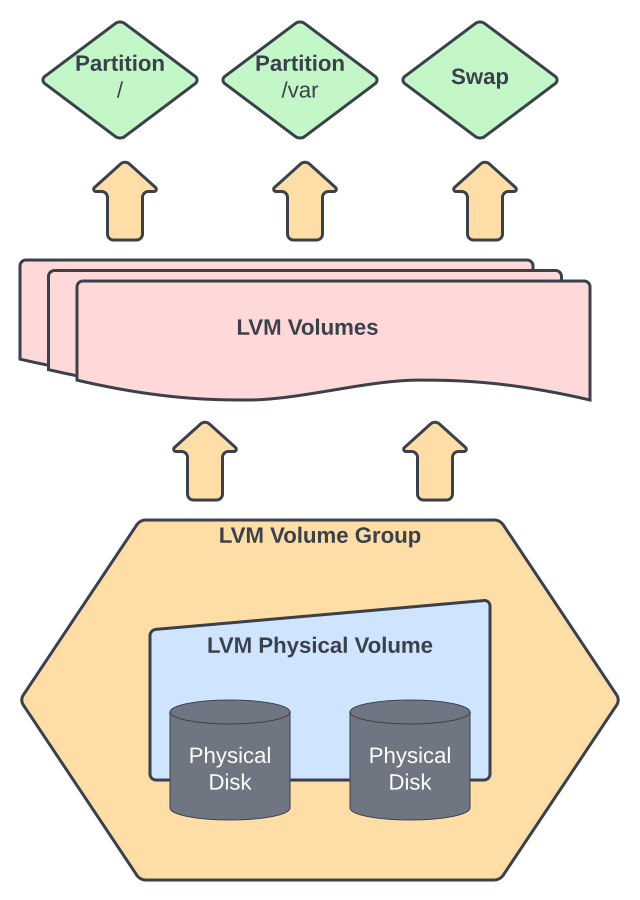
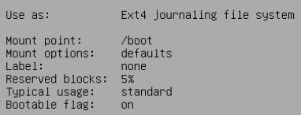
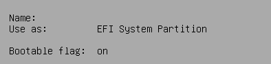

***
LVM
***

Intro
#####

LVM is a disk-management system that adds some nice functionality in comparison to using bare partitions.

It creates a layer between the physical disks and partitions.

|lvm|

This allows you to:

- Work around the common problem of resizing partitions that are not in the last position on the physical disk

- Creation of volume snapshots

- Thin-Provisioned volumes

- Options to configure RAID

- Implementation of write caches

More information can be found `in the RedHat documentation <https://access.redhat.com/documentation/en-us/red_hat_enterprise_linux/8/html/configuring_and_managing_logical_volumes/index>`_!

----

Usage
#####

Navigation
**********

How to get the status and information of your current setup.

Overview
========

The 'lsblk' command shows you an overview of your current storage configuration.

.. code-block:: bash

  root@superstes:~# lsblk
  > NAME         MAJ:MIN RM  SIZE RO TYPE MOUNTPOINT
  > sda            8:0    0   30G  0 disk
  > |-sda1         8:1    0  487M  0 part /boot
  > |-sda2         8:2    0    1K  0 part
  > `-sda5         8:5    0 29.5G  0 part
  >   |-vg0-root 254:1    0  9.7G  0 lvm  /
  >   |-vg0-var  254:2    0  9.7G  0 lvm  /var
  >   `-vg0-swap 254:3    0  1.9G  0 lvm  [SWAP]
  > sdb            8:16   0  100G  0 disk
  > `-vg1-data   254:0    0   50G  0 lvm  /mnt/data

Physical volumes
================

These commands show you how LVM sees your physical disks.

.. code-block:: bash

  root@superstes:~# pvs
  > PV         VG  Fmt  Attr PSize    PFree
  > /dev/sda5  vg0 lvm2 a--   <29.52g  <8.35g
  > /dev/sdb   vg1 lvm2 a--  <100.00g <50.00g

  root@superstes:~# pvdisplay
  # prettified
  > --- Physical volume ---
  > PV Name               /dev/sdb
  > VG Name               vg1
  > PV Size               100.00 GiB / not usable 4.00 MiB
  > Total PE              25599
  > Free PE               12799
  > Allocated PE          12800
  >
  > --- Physical volume ---
  > PV Name               /dev/sda5
  > VG Name               vg0
  > PV Size               29.52 GiB / not usable 2.00 MiB
  > Total PE              7557
  > Free PE               2137
  > Allocated PE          5420

That can be useful if you resize the (*virtual*) physical disk and are not sure if LVM realized the changes.

Volume groups
=============

These commands show you the existing Volume Groups.

.. code-block:: bash

  root@superstes:~# vgs
  > VG  #PV #LV #SN Attr   VSize    VFree
  > vg0   1   3   0 wz--n-  <29.52g  <8.35g
  > vg1   1   1   0 wz--n- <100.00g <50.00g

  root@superstes:~# vgdisplay
  # prettified
  > --- Volume group ---
  > VG Name               vg1
  > VG Access             read/write
  > VG Status             resizable
  > MAX LV                0
  > Cur LV                1
  > Open LV               1
  > Max PV                0
  > Cur PV                1
  > Act PV                1
  > VG Size               <100.00 GiB
  > Alloc PE / Size       12800 / 50.00 GiB
  > Free  PE / Size       12799 / <50.00 GiB
  >
  > --- Volume group ---
  > VG Name               vg0
  > VG Access             read/write
  > VG Status             resizable
  > VG Size               <29.52 GiB
  > Alloc PE / Size       5420 / 21.17 GiB
  > Free  PE / Size       2137 / <8.35 GiB

Logical Volumes
===============

These commands show you the existing Logical Volumes.

.. code-block:: bash

  root@superstes:~# lvs
  > LV   VG  Attr       LSize  Pool Origin Data%  Meta%  Move Log Cpy%Sync Convert
  > root vg0 -wi-ao---- <9.66g
  > swap vg0 -wi-ao---- <1.86g
  > var  vg0 -wi-ao---- <9.66g
  > data vg1 -wi-ao---- 50.00g

  root@superstes:~# lvdisplay
  # prettified
  > --- Logical volume ---
  > LV Path                /dev/vg1/data
  > LV Name                data
  > VG Name                vg1
  > LV Write Access        read/write
  > LV Status              available
  > LV Size                50.00 GiB
  >
  > --- Logical volume ---
  > LV Path                /dev/vg0/root
  > LV Name                root
  > VG Name                vg0
  > LV Size                <9.66 GiB
  >
  > --- Logical volume ---
  > LV Path                /dev/vg0/var
  > LV Name                var
  > VG Name                vg0
  > LV Size                <9.66 GiB
  >
  > --- Logical volume ---
  > LV Path                /dev/vg0/swap
  > LV Name                swap
  > VG Name                vg0
  > LV Size                <1.86 GiB

----

Create
******

OS Setup
========

If you set-up Ubuntu or Debian you need to create your LVM-config using the graphical setup!

Once your main partitions are placed on non-LVM volumes - it is hard to move them.

It might be easier to just reinstall the machine.

Bootable
--------

You might need to create your **boot-partition 'outside' the LVM**!

I found that EFI boot did not really work when put inside a LVM volume.

Therefor you might want to create a 512MB primary partition at the begin of your disk-layout that acts as 'EFI bootable' or '/boot'.

Example for BIOS:

|boot_bios|

Example for UEFI:

|boot_efi|

Add physical volume
===================

1. Add physical volume

2. Make sure LVM recognized the new disk:

  .. code-block:: bash

    pvscan

  Remember the name of your new disk.

3. Create a new volume group or add the physical volume to an existing one:

  .. code-block:: bash

    # create new one
    vgcreate <NAME-OF-NEW-VOLUME-GROUP> /dev/<NAME-OF-NEW-DISK>
    #  example: vgcreate vg1 /dev/sdb

    # add to existing one (ADVANCED USAGE)
    vgextend <NAME-OF-EXISTING-VOLUME-GROUP> /dev/<NAME-OF-NEW-DISK>
    #  example: vgextend vg0 /dev/sdb

4. Create a new logical volume - if needed:

  .. code-block:: bash

    lvcreate -n <NAME-OF-NEW-VOLUME> -L <SIZE-OF-NEW-VOLUME> <NAME-OF-VOLUME-GROUP>
    #  example: lvcreate -n data -L 20G vg1

5. Create file-system: (*'ext4' in this case*)

  .. code-block:: bash

    mkfs.ext4 /dev/mapper/<NAME-OF-VOLUME-GROUP>-<NAME-OF-NEW-VOLUME>
    #  example: mkfs.ext4 /dev/mapper/vg1-data

6. Mount volume:

  .. code-block:: bash

    # 1. create mount directory
    mkdir -p /<PATH-TO-MOUNTPOINT>
    #  example: mkdir -p /mnt/data

    # 2. mount permanently
    # 2.1. edit fstab-config
    sudo nano /etc/fstab

    # 2.2. append line
    /dev/mapper/<NAME-OF-VOLUME-GROUP>-<NAME-OF-NEW-VOLUME> /<PATH-TO-MOUNTPOINT> <NAME-OF-FILESYSTEM> defaults 0 2
    #  example: /dev/mapper/vg1-data /mnt/data ext4 defaults 0 2

    # 2.3. save and exit
    # 2.4. mount
    sudo mount -a

    # check if volume was mounted correctly (yes - if shown in output)
    mount | grep "/<PATH-TO-MOUNTPOINT>"
    #  example: mount | grep "/mnt/data"

----

Resize
******

.. warning::

  If you don't know what you are doing => you should not make changes like these on an important system!

  You might **BREAK YOU SYSTEM**!!

  Try it on an useless VM and play around with it or leave it to the pros.

We need to go through these steps:

1. Extend the physical drive or partition

  1.1. Drive

    You might need to resize the disk in your virtual environment/hypervisor.

  1.2. Partition - entering fdisk

    .. code-block:: bash

        # start fdisk targeting the modified disk
        fdisk /dev/<NAME-OF-DISK>
        #  example: fdisk /dev/sdb

        # show current partition layout
        p

  1.3. Partition - direct vs nested

    Sometimes the target partition might be encapsulated inside an 'extended' partition.

    It might look like this:

    .. code-block:: bash

      fdisk -l /dev/sda
      > Device     Boot   Start      End  Sectors  Size Id Type
      > /dev/sda1  *       2048   999423   997376  487M 83 Linux
      > /dev/sda2       1001470 25163775 24162306 11.5G  5 Extended
      > /dev/sda5       1001472 25163775 24162304 11.5G 8e Linux LVM

    In that case you will have to delete and re-add both of these partitions to extend them.

    .. code-block:: bash

        # delete partition you want to extend
        d
        => number of partition

        # delete the extended partition
        d
        => number of partition

        # re-create the extended partition
        n
        => choose 'extended'
        e
        => enter or choose custom partition number
        => enter
        => enter

        # re-create the target partition
        n
        => enter
        => enter
        => remove the Signature?
        n  # else your LVM config will be gone

        # modify partition type
        t
        => enter partition number
        8e  # for LVM disk

        # verify the layout is the same as before (except being bigger)
        p

        # save and write
        w

        # example:
        fdisk /dev/sda
        d ENTER 5 ENTER
        d ENTER 2 ENTER
        n ENTER e ENTER 2 ENTER ENTER ENTER
        n ENTER ENTER n ENTER
        t ENTER 5 ENTER 8e ENTER
        w

    If that is not the case it is a little easier:

    .. code-block:: bash

        # delete partition you want to extend
        d
        => number of partition to increase

        # re-create the partition
        n
        => enter or choose custom partition number
        => enter
        => enter
        => remove the Signature?
        n  # else your LVM config will be gone

        # modify partition type
        t
        => enter partition number
        8e  # for LVM disk

        # verify the layout is the same as before (except being bigger)
        p

        # save and write
        w

        # example:
        fdisk /dev/sda
        d ENTER 2 ENTER
        n ENTER p ENTER 2 ENTER ENTER ENTER n ENTER
        t ENTER 2 ENTER 8e ENTER
        w

2. Resize the LVM physical volume

  .. code-block:: bash

    pvresize /dev/sdX

3. Extend the LVM volume group

  .. code-block:: bash

     vgextend vg0 /dev/sdX

4. Extend the LVM logical volume

  .. code-block:: bash

      lvextend /dev/vg0/lv1 -L 20GB

5. Update the partition size

  .. code-block:: bash

     resize2fs /dev/mapper/vg0-lv1

Script
------

.. code-block:: bash

    #!/bin/bash
    PD='sda'
    LVM_PV="${PD}2"
    LVM_VG='vg0'
    LVM_LV='lv1'
    EXT='20GB'

    fdisk "/dev/${PD}"
    pvresize "/dev/${LVM_PV}"
    vgextend "${LVM_VG}" "/dev/${LVM_PV}"
    lvextend "/dev/${LVM_VG}/${LVM_LV}" -L "${EXT}"
    resize2fs "/dev/mapper/${LVM_VG}-${LVM_LV}"
