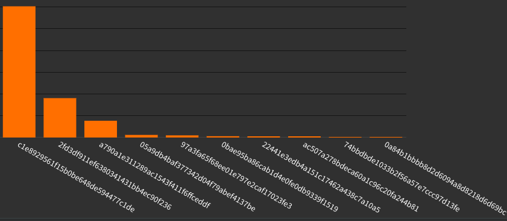

.. _infra_waf:

.. include:: ../../_inc/head.rst

.. |log_asn_blocks| image:: ../../_static/img/infra/waf_log_asn_blocks.png
   :class: wiki-img

***************************
Web Application Firewalling
***************************

First we'll go through some basic knowledge and after that we'll look into **practical** log analysis.

Level of attacks
################

There are some different levels of attacks you will encounter:

1. **Bad crawlers**

   Gathering information from your site for some unknown use-case using GET/HEAD.

   You might be able to block them by implementing :ref:`bot-detection <infra_waf_bot_detect>` and :ref:`crawler verification <infra_waf_crawler_verify>`.

2. **Probes**

   Checking your site for known exploits that are far-spread or common data-/information-leaks.

   They only use GET/HEAD.

   You might be able to block them by creating a simple ruleset from the information you could gather by analyzing the request logs.

3. **Dumb scripts**

   This one might try to exploit single functions behind an URL or submit unprotected forms.

   Attackers will not change the user-agent of their http-client or set it to none.

   They might already use a pool of IP-addresses.

   You can easily block them by creating a list of bad user-agents.

4. **Better script**

   Also might try to exploit single functions behind an URL or submit unprotected forms.

   Attackers change their user-agent and use a pool of IP-addresses.

   Sometimes they still use a static user-agent or show the same major browser version but with different minor versions and operating system versions. (*p.e. Chrome 103.x.x from Windows NT 6.x-10.x*)

   The TLS-fingerprint will always be the same as the actual http-client does not change.

   They might also forget to set a referer or some *accept* headers that are set by all mainstream browsers nowadays.

   Client-side fingerprinting will catch them.

5. **Advanced bot tools**

   There are some bot-tools out there that can mimic a default browser in nearly every aspect.

   It's a continuous battle between them and client-side fingerprinting to fight for/against detection.

   These kind of attacks might be detectable by abnormal traffic patterns :ref:`related to GeoIP country/ASN <infra_waf_geoip>`.

   Most unofficial botnets use hijacked servers to proxy their requests. If you are able to find out that user-actions are performed by clients that originate from hosting-/datacenter-IPs you might be onto something.

   You can also just make it harder to perform important actions by using `captcha <https://www.hcaptcha.com/>`_ or some other logic. Of course - that is a fight against AI tools.

6. **Automation with real Browsers**

   To get a clean browser fingerprint some attacker may use actual mainstream browsers (with GUI) and use auto-clickers or similar tools to automate website interactions.

   These can get stopped by using captcha or monitoring the mouse movement & keyboard strokes using javascript.

7. **Human bots**

   As a last resort - some might even leverage humans as 'bots'.

   Some countries have low price-points for human work-hours. An example is India.

   There are whole companies that provide such a service. You tell them what to do and they have thousands of smartphones with proxies/VPNs that can target a website.

   As the devices are actual 'users' and can handle some anti-bot logic they might be hard to fight.

   It helps if you create some alerts for web-actions (*p.e. POST on some form*) that will be triggered if a threshold is exceeded. That way you can manually check if there is some unusual traffic going on.

.. _infra_waf_fp:
Fingerprinting
##############

Fingerprinting is used to:

* identify clients across IP addresses

* give us more information to identify bad traffic patterns that might indicate an attack

Usually systems use both client-side and server-side fingerprinting.

See also: `information provided by niespodd <https://github.com/niespodd/browser-fingerprinting>`_

Server-Side Fingerprint
***********************

This is most of the times implemented on your proxy/WAF or the application itself.

It is pretty straight-forward to implement, but has some major limitations as we are limited by the information we get from the client.

Therefor it alone cannot be used to get an unique fingerprint per client.

:ref:`GeoIP information <infra_waf_geoip>` like country and ASN can be very useful to limit the matching-scope of such a fingerprint - if you want to lower the risk of blocking/flagging a single one. (more uniqueness, less global matching)

**How can it be assembled?**

* boolean values (1/0)

  * existence of headers (*referer, accept, accept-encoding, accept-language*)

  * existence of header values

  * settings inside headers

  * Is the domain inside the request or 'just' set as host-header?

  * sorting of URL-parameters or values inside headers or cookies

  * upper-/lower-/mixed-case of values

  * unusual special characters inside values

  * LF or CRLF line breaks used

  * usage of whitespace

* hashes

  * hash of some header-/cookie-value

  * of the TLS-Fingerprint

* information

  * limiting the match-scope by using the first 8-16 bits of the IP-address, GeoIP country and/or GeoIP ASN

TLS Fingerprint
===============

The SSL/TLS fingerprint can be useful as it differs between http-clients.

Nearly each http-client software and version of it uses a specific set of TLS settings. But there are overlaps between http-clients or be forged by attackers.

The common settings used to build such a fingerprint are:

.. code-block:: bash

    SSLVersion,Cipher,SSLExtension,EllipticCurve,EllipticCurvePointFormat

    Example: 769,47-53-5-10-49161-49162-49171-49172-50-56-19-4,0-10-11,23-24-25,0
    Example Hashes:
      * aeaf2f865911f886e3f721156a5f552e (wget)
      * ac507a278bdeca60a1c96c29fa244b81 (curl)
      * 63f63ca1aa38d95aae0be017b760408b (firefox 118-120)

Such a fingerprint enables us to compare it against the user-agent a client supplied. If there is an abnormality we can investigate it.

You could also create a mapping of known-good user-agents to TLS fingerprints and block/flag requests that don't match.

But for now there seems to be no public JA3 fingerprint database to compare your findings against. But I have a project like that in my backlog.. (;

See also: `JA3 SSL-fingerprint <https://github.com/salesforce/ja3>`_

----

Client-Side Fingerprint
***********************

Creating a browser-fingerprint with information that is available on the client can be very useful.

We have access to much more information on the client that allows us to create fingerprints with high-precision uniqueness.

**Information that might be used:**

* is javascript enabled

* environment/settings

  * screen size

  * color depth/inversion

  * languages

  * timezone

  * storage preferences

  * canvas

  * fonts

  * are cookies enabled

  * audio

* operating system

* hardware

  * cpu & concurrency

  * screen resolution

  * memory

  * screen touch support

* browser

  * type and flavor

  * plugins

  * webGL

**Some existing libraries:** (*Note: I have not tested them*)

* (*pay-to-win*) `fingerprintJS Repository <https://github.com/fingerprintjs/fingerprintjs>`_, `fingerprintJS example <https://fingerprintjs.github.io/fingerprintjs/>`_, `fingerprintJS information <https://fingerprint.com/>`_

* `creepJS Repository <https://github.com/abrahamjuliot/creepjs>`_, `creepJS example <https://abrahamjuliot.github.io/creepjs/>`_, `creepJS information <https://gologin.com/creepjs>`_

* `supercookie <https://github.com/jonasstrehle/supercookie>`_, `supercookie example <https://demo.supercookie.me/identity>`_, `supercookie Docs <https://supercookie.me/workwise>`_

* `cross-browser <https://github.com/Song-Li/cross_browser>`_, `cross-browser example <https://uniquemachine.org/#fingerprint>`_

----

.. _infra_waf_bot_detect:
Bot detection
#############

You might want to flag requests that might be bots so your application can handle them differently.

You can use a boolean flag or a bot-score.

Either way you might want to block 'dumb script' bots first or flag them as such.

Script bots
***********

How might one detect them?

* Search the user-agent for common http-clients used by scripting languages:

  * Headless browsers (\*headless\*)

  * Python3 libraries (\*python\*, scrapy, aiohttp, httpx, ...)

  * Golang (go-http-client, ...)

  * Javascript packages (axios, ...)

  * Shell tools (curl, wget, ...)

  * Powershell

  * C++ (cpp-httplib)

  * C#

  * Java (\*java\*)

  * Ruby (\*ruby\*)

  * Perl (\*perl\*)

  * PHP (guzzlehttp, phpcrawl, ...)

  * Darknet crawlers (test-bot, \*tiny-bot, fidget-spinner-bot, ...)

  * No user-agent at all

This list is only scratching the surface of tools/libraries that are used in the wild. You will have to check your logs and extend the list if needed.

Actual bots
***********

Note: This bot-check will not differentiate between 'good crawler bots' and others.

Note: If you have a client-side fingerprint implemented - you might also use that detailed information to further filter-out bots.

You might want to **flag a request as possible bot** if:

* They use known good-crawler user-agents

* They have 'bot', 'spider' or 'monitor' in their user-agent

* They have headers like 'accept', 'accept-language', 'accept-encoding' or 'referer' unset

   Note: You might encounter false-positives on the users 'entry page' if it is the first site the user opens (*no referer set*). But this is uncommon.

   Note: Old browsers (<2015) might not set the \*accept\* headers. But this is uncommon nowadays.

* They originate from

   * a datacenter (*GeoIP database needed*)

   * a country that is not expected to request your site (*GeoIP database needed*)

   * an ASN that is known to be used by bots: `ASN spamlist <https://cleantalk.org/blacklists/asn>`_, `Spamhaus ASN-DROP <https://www.spamhaus.org/news/article/820/the-return-of-the-asn-drop>`_ (*GeoIP database needed*)

   * IPs that are known to be used by bots: `Tor exit node IPList <https://check.torproject.org/torbulkexitlist>`_, `Spamhaus DROP <https://www.spamhaus.org/drop/>`_

Going further - you might want to **flag them as 'bad'** if:

* They use a common good-crawler user-agent but failed the :ref:`crawler verification <infra_waf_crawler_verify>`

* You can use the ASN-/IP-Lists mentioned above

----

.. _infra_waf_crawler_verify:
Crawler verification
####################

The large organizations that use crawlers to supply their services with information will provide you with a way to verify if a crawler, that uses their user-agent, is a legitimate one.

Most will either:

* configure their bot source-IPs with a specific reverse-DNS (PTR) record

* supply you with a way to check their source-IP with a list of IP-ranges

**Examples**:

* `Google Bots via reverse-DNS <https://developers.google.com/search/docs/crawling-indexing/verifying-googlebot>`_

* `Bing Bots via reverse-DNS <https://www.bing.com/webmasters/help/how-to-verify-bingbot-3905dc26>`_

* `Yandex Bots via reverse-DNS <https://yandex.com/support/webmaster/robot-workings/check-yandex-robots.html>`_

* `Facebook Bots via IP-List <https://developers.facebook.com/docs/sharing/bot>`_

----

.. _infra_waf_geoip:

GeoIP information
#################

GeoIP databases can help you to identify attacks.

You might either want to implement such lookups into your proxy or log-server.

The most **interesting data** in my opinion is:

* Country

* ASN (*internet-/hosting-provider*)

* `Hosting detection <https://ipapi.is/hosting-detection.html>`_

* `VPN/Proxy/Tor/Relay detection <https://ipinfo.io/developers/privacy-detection-database>`_

**You can check-out some databases**:

* Maxmind Free GeoLite2-databases: `GeoLite2 database download <https://dev.maxmind.com/geoip/geolite2-free-geolocation-data>`_, `GeoLite2 database information <https://dev.maxmind.com/static/pdf/GeoLite2-IP-MetaData-Databases-Comparison-Chart.pdf>`_, `Maxmind Docs <https://dev.maxmind.com/geoip/docs/databases/city-and-country#binary-databases>`_

* Maxmind Paid databases: `Maxmind API <https://dev.maxmind.com/geoip/docs/web-services/requests>`_, `Maxmind databases <https://www.maxmind.com/en/geoip-databases>`_

* IP-Info: `ipinfo.io API <https://ipinfo.io/pricing#data>`_, `ipinfo.io Docs <https://ipinfo.io/developers/ip-to-geolocation-database>`_

* IP-API: `ipapi.is Docs <https://ipapi.is/geolocation.html>`_, `ipapi.is FREE databases <https://github.com/ipapi-is/ipapi>`_

----

Analyzing Request Logs
######################

If you want to protect a web-application from threats you will have to analyze the requests targeting it.

When analyzing request/access logs the right way, you might be able to detect 'hidden' attacks targeting the application.

I would highly recommend log-server solutions like `GrayLog <https://graylog.org/products/source-available/>`_ or `Grafana Loki <https://grafana.com/oss/loki/>`_ to have a Web-UI that enables you to deeply analyze your log-data.

Server-Side information
***********************

As mentioned above in the :ref:`server-side fingerprint section <infra_waf_fp>` - we do not have that much information available when only doing server-side inspection.

Therefore it can be very useful to implement some :ref:`GeoIP database lookups <infra_waf_geoip>` to gain more options for analyzing the data we have.

Most times we will want to group our data by two to four attributes to visualise correlations.

Bot flagging
============

If you have bot-flags configured you can get a brief overview of how many bots and script-bots access your site:

|log_time_bot|

|log_time_bot_bad|

Per-path analysis
=================

If you have specific endpoints/URLs/paths that are targeted by attack - you should filter the logs to reduce the scope of your statistics and get better results:

1. Bots that target the path using POST:

|log_time_path_bot|

2. Status-Codes/Blocks of POST requests

To one path:

|log_time_path_sc|

To another path:

|log_time_path_sc2|

GeoIP information
=================

You might recognize how useful such information can be.

Bots by country:

|log_country_bot|

Script-Bots by country:

|log_country_botbad|

Normal requests vs bot-requests by country:

|log_country_bot_normal|

Requests by country over time:

|log_time_country|

Requests by ASN:

|log_asn|

Blocks by ASN:

|log_asn_blocks|

Fingerprints
============

Fingerprints like JA3-TLS can also be useful for analyzing traffic.

POST requests to specific path by status-code:

|log_path_ja3_bot|

POST requests to specific path by source-network:

|log_path_ja3_src|

User Agents
===========

You may also be able to find useful links by checking the user agents.

POST requests to specific path by user-agent and TLS-fingerprint.

|log_path_ua_ja3|

POST requests to specific path by user-agent, TLS-fingerprint and block.

|log_path_ua_ja3_block|

Errors & Blocks
===============

HTTP 4xx responses over time: (*red + orange = blocks*)

|log_4xx_time_sc|

HTTP 4xx responses by source-networks:

|log_4xx_src|

HTTP 4xx responses by ASN:

|log_4xx_asn|

HTTP 4xx responses by country:

|log_4xx_country|

Blocks by country:

|log_blocks_country|

Blocks by TLS fingerprint:

|log_blocks_ja3|

----

Client-Side information
***********************

You will have to send/pass the information, gathered by Javascript on the client, to your server.

tbc..
