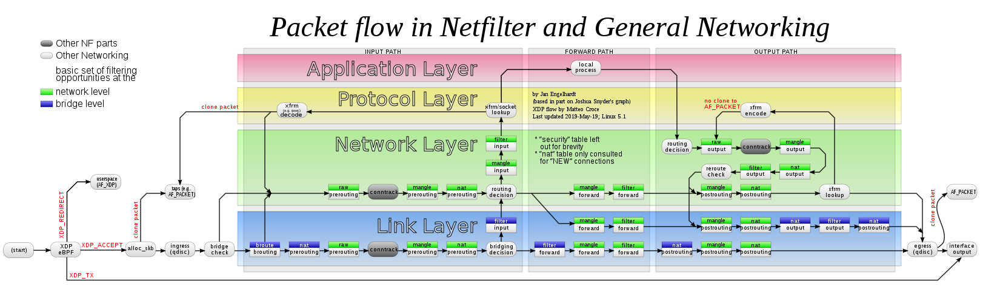
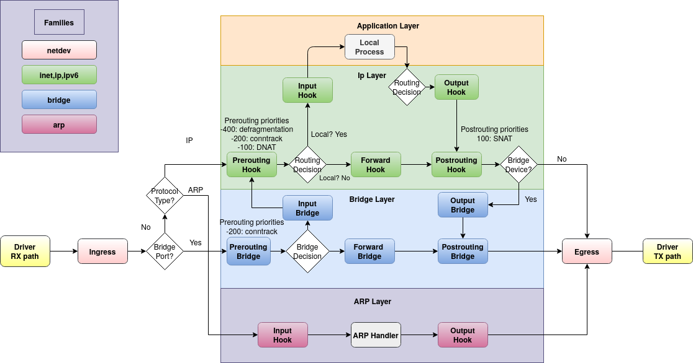

.. _net_nftables

.. include:: ../../_inc/head.rst

********
NFTables
********

----

Introduction
############

Chain hooks/Table families
**************************

|nft_hooks|

Packet flow
***********

|nft_flow|

----

References
**********

* `Quick reference <https://wiki.nftables.org/wiki-nftables/index.php/Quick_reference-nftables_in_10_minutes>`_
* `Change history <https://wiki.nftables.org/wiki-nftables/index.php/List_of_updates_since_Linux_kernel_3.13>`_
* `Differences with IPTables <https://wiki.nftables.org/wiki-nftables/index.php/Main_differences_with_iptables>`_
* Configuration

  * `tables <https://wiki.nftables.org/wiki-nftables/index.php/Quick_reference-nftables_in_10_minutes#Tables>`_, `table families <https://wiki.nftables.org/wiki-nftables/index.php/Nftables_families>`_
  * `chain know-how <https://wiki.nftables.org/wiki-nftables/index.php/Configuring_chains>`_, `chains <https://wiki.nftables.org/wiki-nftables/index.php/Quick_reference-nftables_in_10_minutes#Chains>`_, `chain hooks <https://wiki.nftables.org/wiki-nftables/index.php/Netfilter_hooks>`_
  * `rule know-how <https://wiki.nftables.org/wiki-nftables/index.php/Simple_rule_management>`_, `rules <https://wiki.nftables.org/wiki-nftables/index.php/Quick_reference-nftables_in_10_minutes#Rules>`_
  * `sets <https://wiki.nftables.org/wiki-nftables/index.php/Sets>`_
  * `dynamic sets <https://wiki.nftables.org/wiki-nftables/index.php/Updating_sets_from_the_packet_path>`_, `elements <https://wiki.nftables.org/wiki-nftables/index.php/Element_timeouts>`_
  * `counters <https://wiki.nftables.org/wiki-nftables/index.php/Counters>`_
  * `limits <https://wiki.nftables.org/wiki-nftables/index.php/Rate_limiting_matchings>`_
  * `meters <https://wiki.nftables.org/wiki-nftables/index.php/Meters>`_
  * `maps <https://wiki.nftables.org/wiki-nftables/index.php/Maps>`_, `vmaps <https://wiki.nftables.org/wiki-nftables/index.php/Verdict_Maps_(vmaps)>`_
  * `set meta information <https://wiki.nftables.org/wiki-nftables/index.php/Setting_packet_metainformation>`_, `match meta information <https://wiki.nftables.org/wiki-nftables/index.php/Matching_packet_metainformation>`_

* NAT

  * `source/destination NAT <https://wiki.nftables.org/wiki-nftables/index.php/Performing_Network_Address_Translation_(NAT)>`_
  * `multi NAT <https://wiki.nftables.org/wiki-nftables/index.php/Multiple_NATs_using_nftables_maps>`_
  * `load balancing <https://wiki.nftables.org/wiki-nftables/index.php/Load_balancing>`_

* Examples

  * `Ruleset for server <https://wiki.nftables.org/wiki-nftables/index.php/Simple_ruleset_for_a_server>`_
  * `Ruleset for workstation <https://wiki.nftables.org/wiki-nftables/index.php/Simple_ruleset_for_a_workstation>`_

* `math operations <https://wiki.nftables.org/wiki-nftables/index.php/Math_operations>`_
* `mangle package headers <https://wiki.nftables.org/wiki-nftables/index.php/Mangling_packet_headers>`_
* `expressions <https://wiki.nftables.org/wiki-nftables/index.php/Building_rules_through_expressions>`_
* `routing information <https://wiki.nftables.org/wiki-nftables/index.php/Matching_routing_information>`_
* `bridge filtering <https://wiki.nftables.org/wiki-nftables/index.php/Bridge_filtering>`_
* `connection tracker helpers <https://wiki.nftables.org/wiki-nftables/index.php/Conntrack_helpers>`_
* `debugging <https://wiki.nftables.org/wiki-nftables/index.php/Ruleset_debug/tracing>`_

----

Installation
############

Kernel Modules
**************

Some functionality of NFTables might not be enabled by default.

To check which was enabled at compile-time - check the config file:

.. code-block:: bash

    cat "/boot/config-$(uname -r)" | grep -E "CONFIG_NFT|CONFIG_NF_TABLES"

To find all existing modules:

.. code-block:: bash

    find /lib/modules/$(uname -r) -type f -name '*.ko' | grep -E 'nf_|nft_'

To enable a module:

.. code-block:: bash

    modprobe nft_nat
    modprobe nft_tproxy

----

Usage
#####

Config File
***********

NFTables can be completely configured from one or more config files.

Most times you might want to use:

* a main config file: '/etc/nftables.conf'
* a configuration directory to include further files: '/etc/nft.conf.d/'

The systemd service will load the main config file by default:

.. code-block:: nft

    # /lib/systemd/system/nftables.service
    [Unit]
    ...

    [Service]
    ...
    ExecStart=/usr/sbin/nft -f /etc/nftables.conf
    ExecReload=/usr/sbin/nft -f /etc/nftables.conf
    ExecStop=/usr/sbin/nft flush ruleset
    ...

Main config file example:

.. code-block:: nft

    #!/usr/sbin/nft -f
    flush ruleset
    include "/etc/nft.conf.d/*.conf"

Then you can add your actual configuration in the configuration directory!

To **test your configuration**:

.. code-block:: bash

    nft -cf /etc/nftables.conf

CLI
***

* `CLI overview <https://wiki.nftables.org/wiki-nftables/index.php/Quick_reference-nftables_in_10_minutes#Nft_scripting>`_
* `Scripting <https://wiki.nftables.org/wiki-nftables/index.php/Scripting>`_

Programmatically
****************

THere are some libraries/modules that enable you to manage NFTables from code directly:

* Backend for the libraries: `libnftables <https://www.mankier.com/5/libnftables-json>`_
* GoLang: `github.com/google/nftables <https://pkg.go.dev/github.com/google/nftables>`_, `source code <https://github.com/google/nftables>`_
* Python3: `documentation <https://ral-arturo.org/2020/11/22/python-nftables-tutorial.html>`_, `source code <https://git.netfilter.org/nftables/tree/py>`_, `examples <https://github.com/aborrero/python-nftables-tutorial>`_

Ansible
*******

See: `NFTables Ansible-Role <https://github.com/ansibleguy/infra_nftables/blob/latest/docs/Example.md>`_

----

Config
######

----

Service
#######

To keep invalid configuration from stopping/failing your `nftables.service` - you can add a config-validation in it:

.. code-block:: text

    # /etc/systemd/system/nftables.service.d/override.conf

    [Service]
    ExecStartPre=/usr/sbin/nft -cf /etc/nftables.conf

    ExecReload=
    ExecReload=/usr/sbin/nft -cf /etc/nftables.conf
    ExecReload=/usr/sbin/nft -f /etc/nftables.conf

    Restart=always
    RestartSec=5s

This will catch and log config-errors before doing a reload/restart.

When doing a system-reboot it will still fail if your config is bad.

----

Addons
######

NFTables lacks some functionality, that is commonly used in firewalling.

You can add a scheduled scripts that add these functionalities to NFTables!

See: `Ansible-managed addons <https://github.com/ansibleguy/addons_nftables>`_

DNS
***

It is nice to have variables that hold the IPs of some DNS-record.

NFTables CAN resolve DNS-records - but will throw an error if the record resolves to more than one IP.. (Error: Hostname resolves to multiple addresses)

See: `NFTables Addon DNS <https://github.com/superstes/nftables_addon_dns>`_

IPLists
*******

This addon was inspired by `the same functionality provided on OPNSense <https://docs.opnsense.org/manual/how-tos/edrop.html#configure-spamhaus-e-drop>`_

It will download existing IPLists and add them as NFTables variables.

IPList examples:

* `Spamhaus DROP <https://www.spamhaus.org/drop/drop.txt>`_
* `Spamhaus EDROP <https://www.spamhaus.org/drop/edrop.txt>`_
* `Tor exit nodes <https://check.torproject.org/torbulkexitlist>`_

See: `NFTables Addon IPList <https://github.com/superstes/nftables_addon_iplist>`_

Failover
********

See: `NFTables Addon Failover <https://github.com/superstes/nftables_addon_failover>`_

----

Examples
########

Ansible
*******

See: `Ansible-based examples <https://github.com/ansibleguy/infra_nftables/blob/latest/docs/UseCaseExamples.md>`_

IPv4 Baseline
*************

IPv6 Baseline
*************

Security Baseline
*****************

Docker host
***********

Proxmox host (PVE)
******************

Forwarder (Router, Network firewall, VPN Server)
************************************************

----

Integrations
############

Fail2Ban
********

Squid
*****
